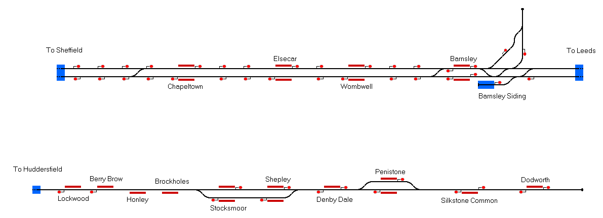

# Penistone Line, South and West Yorkshire
This project represents the Penistone line, which runs between Sheffield and Huddersfield, although only the section between Meadowhall and Lockwood is simulated. This route is an upgraded version of Daniel Gill's original Penistone Line route which can be found [here](https://www.railwayoperationsimulator.com/catalog/community-projects/united-kingdom/penistone-line).

## Current Status

| Stage         | Status        |
| ------------- |:-------------:|
| Track Plan     |  |
| Signalling      |       |
| Naming |       |
| Speed Limits |  |
| Distances |  |
| Timetable |  |
| Documentation |  |

*As this is an upgraded version, lots of this project is already completed. Although, the main aim of this would be to make the simulation more professional, such as adding a more comprehensive timetable*

## Data Sources

- [TRAKSY.UK](https://traksy.uk/live)

Status icons by Freepik, pixelmeetup, Pixel Perfect on FlatIcon.com.
